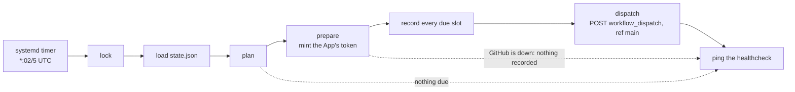

<h1 align="center">dispatch</h1>

<p align="center">The scheduler that starts the workflows in my own repositories.</p>

<p align="center">
  <a href="https://github.com/jshvn/dispatch/actions/workflows/check.yml"></a>
  <a href="LICENSE"></a>
</p>

No workflow here schedules itself; each waits for a `workflow_dispatch`, and this
repository sends it. A systemd timer on a NixOS host ticks every five minutes, fires each
job whose latest slot has not been fired yet, then pings one healthcheck. A host that was
down fires each missed job once, for the latest of its slots, when it comes back. No slot
fires twice. It is one Go binary with no dependency outside the standard library, and it
runs on a one-core VPS.

It is a copy of [katoptra/dispatch](https://github.com/katoptra/dispatch), which does the
same for the katoptra mirrors, pointed at the `jshvn` account and with per-job jitter.

## How to use

A job is one workflow in one jshvn repository and the UTC hours it runs at. Every slot
fires at `HH:42`:

| Slot | UTC | Pacific, winter |
|---|---|---|
| `Hourly` | :42 | :42 |
| `Evening` | 05:42 | 21:42 |
| `Overnight` | 11:42 | 03:42 |
| `Morning` | 17:42 | 09:42 |
| `Afternoon` | 23:42 | 15:42 |

`S0` through `S23` name every hour; the four daily names are aliases for `S5`, `S11`,
`S17` and `S23`. Each repository gets one file in [`schedules/`](schedules), named for
the half of `owner/name` after the slash:

```go
// schedules/terraform.go
var _ = register(Job{Repo: "jshvn/terraform", File: "drift.yml", Slots: Evening})
```

Two slots are `Morning | Evening`. A misspelt slot fails to compile.

A job with `Jitter: 30 * time.Minute` fires each slot up to half an hour late, a different
wait every slot, so its runs do not land on a clock. The wait is drawn from the job and the
slot, so every tick agrees on it, and it rounds up to the next five-minute tick.

The workflow must hold up three things this repository cannot check. A workflow that
fails any of them is dispatched into silence:

1. It declares `workflow_dispatch:` in `on:`.
2. It declares a `concurrency` group with `cancel-in-progress: false`, so a dispatch that
   arrives during a run queues instead of doubling up.
3. It pings its own healthcheck, or its file in `schedules/` says what alerts instead.
   The scheduler never learns whether a run passed.

The App must be installed on the repository too; a repository it cannot see answers the
dispatch with 404. A change reaches the host when the host's flake lock moves to the new
commit. A new job fires at the next tick, for its latest slot.

## How it works

Every five minutes, at `:02`, `:07` and on through `:57`, the timer starts one oneshot
tick:



- **Catch-up is `plan`, not systemd.** Each tick compares every job's latest slot with the
  one `state.json` last recorded for it. Any number of missed slots come out as one due
  slot, so a host down for a day fires each job once when it returns.
- **At most once, by writing ahead.** Every due slot is recorded before the first POST.
  A crash or a failed dispatch loses that slot; nothing retries it, and the job's next
  slot is the retry. The token is minted before the write, since minting starts no run,
  so a GitHub outage at that step records nothing and the next tick tries again.
- **Retries are only where a repeat is harmless.** 10 s, 20 s, 40 s. The token requests
  retry any 5xx, 408, 429 or network error. A dispatch retries only 408, 429 and a
  connection that never opened: a 5xx or a timeout can follow a dispatch GitHub already
  accepted, and a retry would be a second run. GitHub gets two minutes a tick, retries
  included, and the rest of the unit's four is the ping's, so a failing tick still
  reaches `/fail`.
- **One healthcheck for the scheduler.** A clean tick pings the URL; a tick with any
  error pings `/fail` with the error text; a dead host pings nothing.

The files, the constraints and the reasoning behind each choice are in
[`CLAUDE.md`](CLAUDE.md).

## Want your own?

### 1. Fork it

Fork this repository and replace the files in [`schedules/`](schedules) with your own
jobs. The package's test refuses a job outside a `jshvn/` repository; change that prefix,
and `Owner` in `main.go`, to your account's. The installation is looked up on a user
account; for an organization, fork [katoptra/dispatch](https://github.com/katoptra/dispatch),
which looks it up on an org.

### 2. The GitHub App

1. Create an App owned by your account: Repository permissions, Actions, Read and write,
   and nothing else; no webhook.
2. Install it on the account with access to the repositories it runs.
3. Note the App ID and generate a private key. The key is used as GitHub issues it; no
   conversion.

### 3. The healthcheck

One healthchecks.io check with a period of 5 minutes and a grace of 10.

### 4. The host

Add this flake as an input and give the module three files. How the host renders them is
its own business; they are read through `LoadCredential=`, so root-owned 0400 files work.

```nix
{
  imports = [ inputs.jshvn-dispatch.nixosModules.default ];
  services.jshvn-dispatch = {
    enable = true;
    appIdFile = "/run/secrets/jshvn-dispatch-app-id";
    privateKeyFile = "/run/secrets/jshvn-dispatch-private-key";
    healthcheckUrlFile = "/run/secrets/jshvn-dispatch-healthcheck-url";
  };
}
```

The paths are strings: a Nix path literal would copy the secret into the store.

### 5. Prove it, run it

On a laptop with go-task and Docker or Apple `container`:

```sh
task check    # gofmt, go vet, go test, inside the toolbox image; what CI runs
task targets  # every job and its UTC slot times, read from schedules/
```

`nix flake check` builds the package and renders the two units; [`CLAUDE.md`](CLAUDE.md)
has the command for a laptop without nix. Only a real tick proves the App: on the host,
`sudo systemctl start jshvn-dispatch` and read the journal.

## Operating it

`task` alone prints the menu. From a laptop:

```sh
task targets           # what runs and when
task runs              # each target's recent runs on GitHub; needs gh logged in
task runs LIMIT=10     # more of them
```

Every run a target shows as `workflow_dispatch` came from here. On the host:

```sh
systemctl list-timers jshvn-dispatch.timer
journalctl -u jshvn-dispatch -n 50
journalctl -u jshvn-dispatch -p err
sudo cat /var/lib/private/jshvn-dispatch/state.json
sudo STATE_DIRECTORY=/var/lib/private/jshvn-dispatch jshvn-dispatch --dry-run
```

`--dry-run` prints what is due and why, and writes, dispatches and pings nothing.

- **The healthcheck goes quiet.** The host or its timer is down. Nothing is lost: when it
  comes back, the next tick fires every job that missed a slot, once.
- **A tick pings `/fail`.** The error text is in the ping's body and in
  `journalctl -u jshvn-dispatch -p err`. The slot it failed on is gone; the job's next
  slot is the retry.
- **A dispatch answers 404.** Every dispatch is to `ref: main`, so the repository's
  default branch is not `main`, the workflow file is not there, or the App is not
  installed on the repository.
- **Every tick fails on `state.json`.** A corrupt state file stops everything, since
  empty state would fire every job again. Repair it by hand, or delete it: every job then
  fires once.

## Reference

[`CLAUDE.md`](CLAUDE.md) is the design: the files, the constraints, and what breaks if a
choice is undone.

MIT licensed. Built by [Josh Vaughen](https://ijosh.com).
