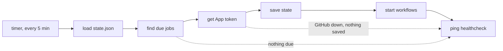

<h1 align="center">dispatch</h1>

<p align="center">Runs the workflows in my own repos on a schedule.</p>

<p align="center">
  <a href="https://github.com/jshvn/dispatch/actions/workflows/check.yml"></a>
  <a href="LICENSE"></a>
  <a href="https://github.com/jshvn/dispatch#how-it-works"></a>
</p>

My scheduled GitHub Actions workflows have no schedule of their own. This repo starts
them.

- A systemd timer on a NixOS host runs it every five minutes.
- Each run starts any workflow that is due, then pings a healthcheck.
- If the host goes down, each job that missed a run fires once when it comes back.
- A job never fires twice for the same time slot.
- It is one Go binary with no dependencies outside the standard library.

It is a copy of [katoptra/dispatch](https://github.com/katoptra/dispatch), which runs the
katoptra mirrors. This one works with a GitHub user account and can add jitter to a job.

## Adding a job

Each repo gets one file in [`schedules/`](schedules), named after the repo:

```go
// schedules/terraform.go
var _ = register(Job{Repo: "jshvn/terraform", File: "drift.yml", Slots: Evening})
```

Every slot runs at 42 minutes past the hour, UTC:

| Slot | UTC | Pacific (winter) |
|---|---|---|
| `Hourly` | every hour at :42 | every hour at :42 |
| `Evening` | 05:42 | 21:42 |
| `Overnight` | 11:42 | 03:42 |
| `Morning` | 17:42 | 09:42 |
| `Afternoon` | 23:42 | 15:42 |

- `S0` to `S23` name each hour. The four daily names are shortcuts for `S5`, `S11`, `S17`
  and `S23`.
- Combine slots with `|`, like `Morning | Evening`.
- A misspelled slot won't compile.
- Add `Jitter: 30 * time.Minute` to start each run up to 30 minutes late, at a different
  time for every slot. The delay rounds up to the next five-minute tick.

The workflow needs three things that this repo can't check for you:

- `workflow_dispatch:` under `on:`.
- A `concurrency` group with `cancel-in-progress: false`, so a second start waits for the
  first run to finish.
- Its own healthcheck ping, or a comment in its `schedules/` file saying what alerts
  instead. The scheduler starts runs but never sees whether they pass.

The GitHub App also has to be installed on the repo. A change goes live when the host's
flake lock moves to the new commit. A new job fires on the next tick.

## How it works



The timer fires at :02, :07 and every five minutes after that. Each tick:

1. Loads `state.json`, which holds the last slot each job fired for.
2. Works out which jobs are due. A job that missed several slots is due once, for the
   latest one.
3. Gets a token for the GitHub App.
4. Saves the new state.
5. Starts each due workflow on `main`.
6. Pings the healthcheck: the plain URL if everything worked, or `/fail` with the errors.

The state is saved before any workflow starts. If a tick crashes after that, the run for
that slot is lost and the job runs again at its next slot. No run ever starts twice. If
GitHub is down when the token is requested, nothing is saved and the next tick tries again.

Retries wait 10, 20 and then 40 seconds:

- Token requests retry on any 5xx, 408, 429 or network error.
- Workflow starts retry only on 408, 429 or a connection that never opened. GitHub can
  return a 5xx after it has already started the run, so a retry could start it twice.
- GitHub gets two minutes per tick, which leaves time to ping the healthcheck.

The design and the reasons behind it are in [`CLAUDE.md`](CLAUDE.md).

## Running it

`task` on its own prints the menu. From a laptop:

```sh
task check          # gofmt, go vet and go test in the toolbox image, same as CI
task targets        # every job and when it runs
task runs           # recent runs of each job on GitHub (needs gh logged in)
task runs LIMIT=10  # more of them
```

Runs started by this repo show up as `workflow_dispatch`. On the host:

```sh
systemctl list-timers jshvn-dispatch.timer
journalctl -u jshvn-dispatch -n 50
journalctl -u jshvn-dispatch -p err
sudo cat /var/lib/private/jshvn-dispatch/state.json
sudo STATE_DIRECTORY=/var/lib/private/jshvn-dispatch jshvn-dispatch --dry-run
```

`--dry-run` shows what is due and why, without saving, starting or pinging anything.

### When something goes wrong

- **The healthcheck goes quiet.** The host or its timer is down. When it comes back, each
  job that missed a slot fires once.
- **The healthcheck gets a `/fail` ping.** The error is in the ping body and in
  `journalctl -u jshvn-dispatch -p err`. That slot is skipped, and the job runs again at
  its next slot.
- **A workflow start returns 404.** The repo's default branch isn't `main`, the workflow
  file isn't there, or the App isn't installed on the repo.
- **Every tick fails on `state.json`.** The file is corrupt, and nothing runs until it is
  fixed. Repair it by hand or delete it. Deleting it makes every job fire once.

## Run your own

1. **Fork this repo** and replace the files in `schedules/` with your own jobs. The tests
   only accept `jshvn/` repos, so change that prefix to your account's, and change `Owner`
   in `main.go` to match. This version looks up the App on a user account. For an
   organization, fork [katoptra/dispatch](https://github.com/katoptra/dispatch) instead.
2. **Create a GitHub App** owned by your account, with one permission: Actions, read and
   write. It needs no webhook. Install it on the repos it should run. Note the App ID and
   generate a private key. The key works as GitHub issues it.
3. **Create a healthchecks.io check** with a 5 minute period and a 10 minute grace.
4. **Add the flake to your NixOS host** and give the module three files:

   ```nix
   {
     imports = [ inputs.jshvn-dispatch.nixosModules.default ];
     services.jshvn-dispatch = {
       enable = true;
       appIdFile = "/run/secrets/jshvn-dispatch-app-id";
       privateKeyFile = "/run/secrets/jshvn-dispatch-private-key";
       healthcheckUrlFile = "/run/secrets/jshvn-dispatch-healthcheck-url";
     };
   }
   ```

   Keep the paths as strings. A Nix path would copy the secrets into the Nix store, where
   anyone on the host can read them. The files are loaded with `LoadCredential=`, so
   root-owned files with mode 0400 work.
5. **Check it.** On a laptop with go-task and Docker or Apple `container`, run `task check`
   and `task targets`. `nix flake check` builds the package and the systemd units;
   [`CLAUDE.md`](CLAUDE.md) shows how to run it without nix installed. The only real test
   of the App is a live tick: run `sudo systemctl start jshvn-dispatch` on the host and
   read the journal.

## License

MIT. Built by [Josh Vaughen](https://ijosh.com).
